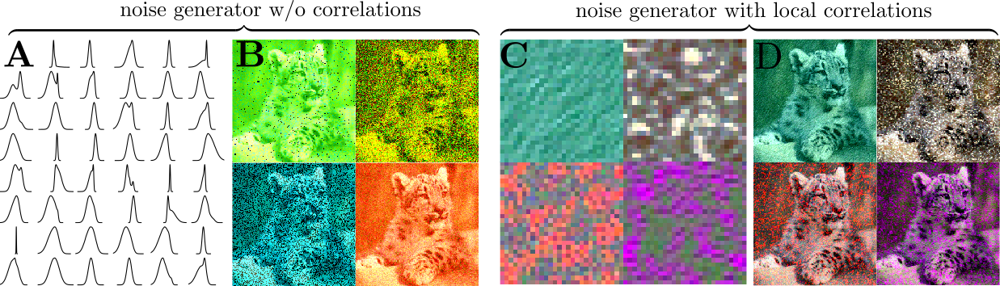

# Increasing the robustness of DNNs against imagecorruptions by playing the Game of Noise

This repository contains trained model weights, training and evaluation code for the paper [Increasing the robustness of DNNs against image corruptions by playing the Game of Noise](https://arxiv.org/abs/2001.06057) by Evgenia Rusak*, Lukas Schott*, Roland Zimmermann*, Julian Bitterwolf, Oliver Bringmann, Matthias Bethge & Wieland Brendel.

We show that a very simple approach -- data augmentation with Gaussian noise -- suffices to surpass state-of-art methods to increase robustness towards common corruptions. Going one step further, we learn the per-pixel distribution to sample noise from adversarially with a simple generative neural network which we call the Noise Generator. Training the Noise Generator and the classifier jointly further increases robustness.


## Download models

Download the trained model weights by either running

```
bash ./Models/download_models.sh
```

or by downloading them from the [Releases on GitHub](https://github.com/bethgelab/game-of-noise/releases).

## Results

The evaluation results are summarized in the Table below.

| Model           | ImageNet val top1 accuracy [%] ↗ | ImageNet-C top1 accuracy [%] ↗ |  ImageNet-C mCE ↘ |
| --------------- |:--------------------------------:|:------------------------------:|:-----------------:|
| Vanilla         | 76.1                             | 39.2                           | 76.7              |
| Speckle         | 75.8                             | 46.4                           | 68.3              |
| Gauss_sigma_0.5 | 75.9                             | 49.4                           | 64.5              |
| Gauss_mult      | 76.1                             | 49.2                           | 65.0              |
| ANT             | 76.1                             | 51.1                           | 62.5              |
| ANT+SIN         | 74.9                             | 52.2                           | 61.2              |
| ANT3x3          | 76.1                             | 50.4                           | 63.4              |
| ANT3x3+SIN      | 74.1                             | 52.6                           | 60.7              |

## Evaluate models

To validate our models, run `python3 main.py`. It is necessary to download the model weights first!

Arguments:
 - `--datadir-clean` the top-level directory of the ImageNet dataset (mandatory)
 - `--imagenetc-path` the top-level directory of the ImageNet-C dataset (mandatory)
 - `--model_name` name of the model that should be evaluated (optional, default: `clean`, possible choices: `clean`, `ANT-SIN`, `ANT`, `Gauss_mult`, `Gauss_sigma_0.5`, `Speckle`)
 - `--workers` number of data loading workers (optional, default: 30)
 - `--test-batch-size` number of images in the batch (optional, default: 256)
 - `--device` device for evaluation (optional, default: 'cuda')

The results are saved as txt files.

## Example Usage

### Evaluate our model trained with Speckle noise data augmentation

It is necessary to specify the paths for the ImageNet validation dataset and the ImageNet-C dataset. Then you can run:
```
python3 main.py -e True --model_name Speckle --datadir-clean /path-to-imagenet-val --imagenetc-path /path-to-imagenet-c
```

### Evaluate our best performing model trained with Adversarial Noise Training and on Stylized ImageNet ANT3x3+SIN

```
python3 main.py -e True --model_name ANT3x3+SIN --ng_type 3x3 --datadir-clean /path-to-imagenet --imagenetc-path /path-to-imagenet-c
```

### Train a robust model with ANT

```
python3 main.py  --mode ANT --datadir-clean /path-to-imagenet --imagenetc-path /path-to-imagenet-c
```

### Train a robust model with ANT3x3

```
python3 main.py  --mode ANT --ng_type 3x3 --datadir-clean /path-to-imagenet --imagenetc-path /path-to-imagenet-c
```

### Train a robust model with ANT+SIN

```
python3 main.py  --mode ANT+SIN --datadir-clean /path-to-imagenet --imagenetc-path /path-to-imagenet-c --datadir-sin /path-to-stylized-imagenet
```

### Train a robust model with Gaussian noise with one specific sigma

```
python3 main.py  --mode Gauss_single --std_gauss 0.5 --datadir-clean /path-to-imagenet --imagenetc-path /path-to-imagenet-c
```

## Examples of adversarial noise

Examples of adversarial noise found by the noise generator during adversarial noise training are displayed below.

A: Examples of learned probability densities over the grayscale version of the noise during ANT1x1 where each density corresponds to one local minimum; B: Example images with sampled uncorrelated adversarial noise; C: Example patches of locally correlated noise with a size of 28x28 pixels learned during ANT3x3; D: Example images with sampled correlated adversarial noise.


