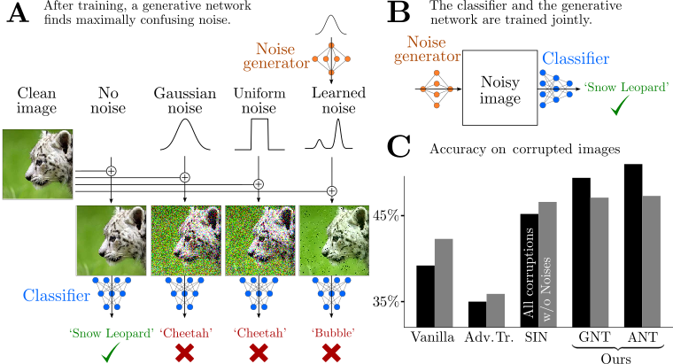

# Increasing the robustness of DNNs against imagecorruptions by playing the Game of Noise

This repository contains trained model weights and evaluation code for the paper [Increasing the robustness of DNNs against image corruptions by playing the Game of Noise](https://arxiv.org/abs/2001.06057) by Evgenia Rusak*, Lukas Schott*, Roland Zimmermann*, Julian Bitterwolf, Oliver Bringmann, Matthias Bethge & Wieland Brendel.

Our core message is that a very simple approach -- data augmentation with Gaussian noise -- suffices to surpass almost all much more sophisticated state-of-art methods to increase robustness towards common corruptions. Going one step further, we learn the per-pixel distribution to sample noise from adversarially with a simple generative neural network which we call the Noise Generator. Training the Noise Generator and the classifier jointly further increases robustness.

## Evaluate models

To validate our models, run  `python3 main.py` or run the provided bash script directly that downloads and evaluates all provided models via `bash run.sh`.

Arguments:
 - `--datadir-clean` the top-level directory of the ImageNet dataset (mandatory)
 - `--imagenetc-path` the top-level directory of the ImageNet-C dataset (mandatory)
 - `--model_name` name of the model that should be evaluated (optional, default: `clean`, possible choices: `clean`, `ANT-SIN`, `ANT`, `Gauss_mult`, `Gauss_sigma_0.5`, `Speckle`)
 - `--workers` number of data loading workers (optional, default: 30)
 - `--test-batch-size` number of images in the batch (optional, default: 256) 

The results are saved as txt files.
